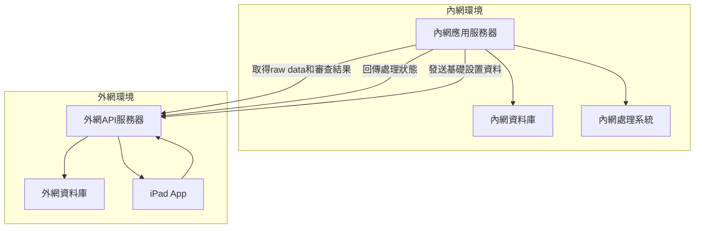
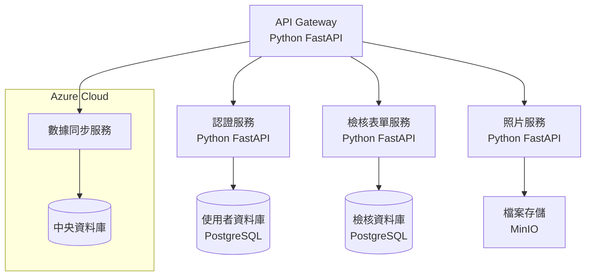
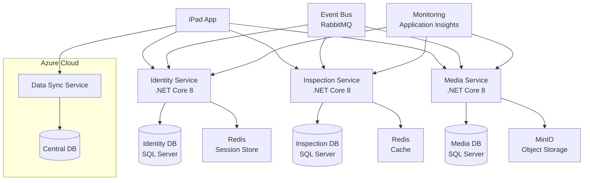
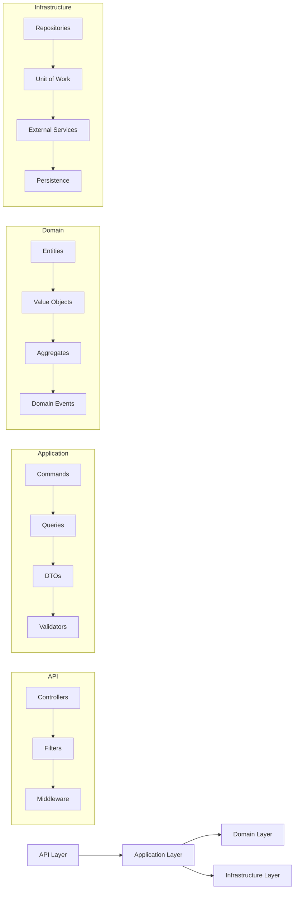
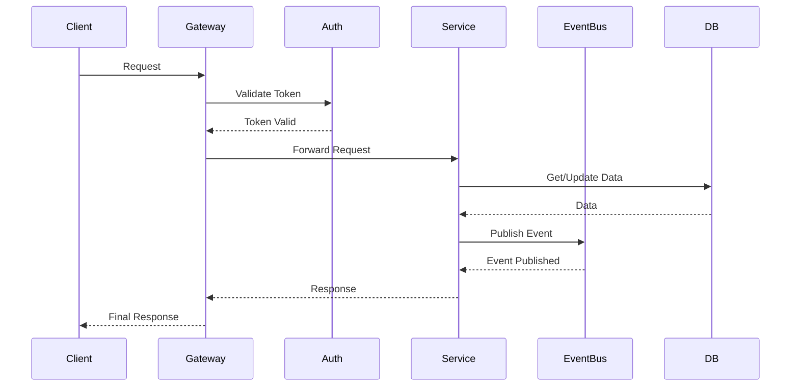

# REL 軍規及IP防水、防塵測試作業平板系統 2.0 App 規格說明

## 1. 系統架構

### 1.1 網路架構


### 1.2 網路架構說明
- **內網環境**
  - 負責最終數據處理和應用
  - 通過API從外網獲取raw data和審查結果
  - 向外網發送基礎設置資料
  - 處理完成後回傳狀態到外網

- **外網環境**
  - API服務器負責數據中轉
  - 儲存iPad上傳的raw data和審查結果
  - 儲存內網發送的基礎設置資料
  - iPad登入時自動更新基礎設置

- **iPad應用**
  - 運行在外網環境
  - 僅與外網API服務器通訊
  - 登入時自動更新基礎設置
  - 上傳檢測數據到外網

### 1.3 前端 (iPad App)
```swift
// 使用 SwiftUI 開發
```

### 1.4 後端 (App Server)
```python
# 使用 Python FastAPI 或 Django REST framework
```

## 2. 功能需求

### 2.1 使用者管理
- 登入/登出功能
- 角色權限管理
  - 檢查員
  - 主管
  - 管理員

### 2.2 檢核表單
- 動態表單配置
- 必填項目驗證
- 自動儲存功能
- 歷史記錄查詢

### 2.3 照片管理
- 拍照功能
- 照片上傳
- 照片與檢核項目關聯
- 照片瀏覽和管理

### 2.4 離線功能
- 本地資料暫存
- 自動同步機制
- 衝突處理

### 2.5 報表功能
- PDF報告產生
- 數據統計和匯出
- 歷史記錄查詢

## 3. 資料結構

### 3.1 使用者資料
```json
{
    "user_id": "string",
    "username": "string",
    "role": "string",
    "department": "string"
}
```

### 3.2 檢核記錄
```json
{
    "check_id": "string",
    "inspector": "user_id",
    "date": "datetime",
    "items": [
        {
            "item_id": "string",
            "value": "string",
            "photos": ["photo_id"]
        }
    ]
}
```

### 3.3 照片資料
```json
{
    "photo_id": "string",
    "check_id": "string",
    "item_id": "string",
    "url": "string",
    "timestamp": "datetime"
}
```

## 4. API 端點

### 4.1 認證 API
```
POST /api/auth/login
POST /api/auth/logout
GET  /api/auth/profile
```

### 4.2 檢核表單 API
```
GET    /api/checks
POST   /api/checks
GET    /api/checks/{check_id}
PUT    /api/checks/{check_id}
DELETE /api/checks/{check_id}
```

### 4.3 照片 API
```
POST   /api/photos
GET    /api/photos/{photo_id}
DELETE /api/photos/{photo_id}
```

## 5. 技術堆疊

### 5.1 前端
- Swift/SwiftUI
- Combine Framework
- Core Data (離線存儲)
- AVFoundation (相機功能)

### 5.2 後端
- Python FastAPI/Django
- PostgreSQL
- Redis (快取)
- S3/MinIO (照片存儲)

### 5.3 部署
- Docker
- Nginx
- HTTPS

## 6. 安全考量
- JWT 認證
- HTTPS 加密
- 資料加密存儲
- 定期備份機制
- 存取權限控制

## 7. 效能優化
- 照片壓縮
- 資料分頁
- API 快取
- 非同步處理

## 8. 擴展性
- 多語言支援
- 客製化表單
- 第三方系統整合
- API 版本控制

## 9. Python FastAPI 微服務架構

### 9.1 服務層架構 (Python)


### 9.2 資料庫架構 (Python/PostgreSQL)
- **主資料庫 (PostgreSQL)**
  - 使用者資料表
  - 檢核記錄表
  - 照片metadata表
  - 權限設定表

- **快取層 (Redis)**
  - 使用者 Session
  - API 響應快取
  - 熱門檢核項目快取

- **檔案存儲 (MinIO)**
  - 照片檔案
  - 報表檔案
  - 備份檔案

### 9.3 微服務架構 (Python FastAPI)
```python
# 服務元件
services = {
    'auth_service': {
        'framework': 'FastAPI',
        'endpoints': ['/login', '/logout', '/profile'],
        'dependencies': ['user_db', 'redis'],
        'scaling': 'horizontal'
    },
    'form_service': {
        'framework': 'FastAPI',
        'endpoints': ['/checks/*'],
        'dependencies': ['check_db', 'redis'],
        'scaling': 'horizontal'
    },
    'photo_service': {
        'framework': 'FastAPI',
        'endpoints': ['/photos/*'],
        'dependencies': ['photo_db', 'minio'],
        'scaling': 'horizontal'
    },
    'data_sync_service': {
        'framework': 'FastAPI',
        'endpoints': ['/sync/*'],
        'dependencies': ['central_db', 'redis'],
        'scaling': 'vertical'
    }
}
```

### 9.4 部署架構 (Python/Docker)
```yaml
# Docker Compose 配置概要
version: '3.8'
services:
  api_gateway:
    image: nginx
    ports:
      - "443:443"
    
  auth_service:
    image: ip68_auth
    build:
      context: ./services/auth
      dockerfile: Dockerfile-python
    replicas: 3
    
  form_service:
    image: ip68_form
    build:
      context: ./services/form
      dockerfile: Dockerfile-python
    replicas: 3
    
  photo_service:
    image: ip68_photo
    build:
      context: ./services/photo
      dockerfile: Dockerfile-python
    replicas: 2
    
  data_sync_service:
    image: ip68_data_sync
    build:
      context: ./services/data_sync
      dockerfile: Dockerfile-python
    replicas: 1
    
  postgres:
    image: postgres:latest
    volumes:
      - pg_data:/var/lib/postgresql/data
      
  redis:
    image: redis:latest
    volumes:
      - redis_data:/data
      
  minio:
    image: minio/minio
    volumes:
      - minio_data:/data
```

### 9.5 監控與日誌 (Python/ELK Stack)
- **監控指標**
  - API 響應時間 (Prometheus)
  - 服務健康狀態 (FastAPI health checks)
  - 資源使用率 (Grafana)
  - 錯誤率統計 (Sentry)

- **日誌系統 (ELK Stack)**
  - Elasticsearch: 日誌存儲
  - Logstash: 日誌收集
  - Kibana: 日誌視覺化

### 9.6 安全架構 (Python/FastAPI)
- **網路安全**
  - WAF (ModSecurity)
  - DDoS 防護 (Cloudflare)
  - SSL/TLS 加密 (Let's Encrypt)

- **應用安全**
  - JWT 認證 (PyJWT)
  - API 限流 (FastAPI limits)
  - 資料加密 (cryptography)
  - CORS 設定 (FastAPI CORS)

### 9.7 備份策略
- **資料庫備份**
  - 每日全量備份 (pg_dump)
  - 每小時增量備份 (WAL)
  - 異地備份 (AWS S3)

- **檔案備份**
  - MinIO 跨區域複製
  - 定期快照
  - 版本控制

## 10. 離線工作架構

### 10.1 本地資料存儲
```swift
// Core Data 模型定義
struct LocalStorage {
    // 檢核表單資料
    struct CheckForm {
        var id: UUID
        var status: String  // draft, pending_sync, synced
        var lastModified: Date
        var content: Data
        var photos: [Photo]
    }
    
    // 本地照片快取
    struct Photo {
        var id: UUID
        var checkFormId: UUID
        var localPath: String
        var uploadStatus: String  // pending, uploaded
        var timestamp: Date
    }
    
    // 同步狀態追蹤
    struct SyncStatus {
        var lastSyncTime: Date
        var pendingChanges: Int
        var syncErrors: [String]
    }
}
```

### 10.2 資料同步策略
- **優先級同步**
  - 高優先級：檢核表單狀態更新
  - 中優先級：新建檢核表單
  - 低優先級：照片上傳

- **衝突處理**
```swift
enum ConflictResolution {
    case useServer    // 使用服務器版本
    case useLocal     // 使用本地版本
    case merge        // 合併變更
    case askUser      // 提示用戶選擇
}

struct SyncConflict {
    func resolveConflict(serverData: Data, localData: Data) -> ConflictResolution {
        // 根據時間戳和變更內容決定解決方案
        if serverData.timestamp > localData.timestamp {
            return .useServer
        }
        // 其他邏輯...
    }
}
```

### 10.3 離線功能範圍
- **完全離線支援**
  - 新建檢核表單
  - 編輯現有表單
  - 拍照和照片關聯
  - 基本資料查詢

- **部分離線支援**
  - 歷史記錄查詢（最近30天）
  - 報表生成（基本版）
  - 使用者驗證（快取token）

- **需要連線功能**
  - 完整歷史記錄
  - 複雜報表生成
  - 用戶權限變更

### 10.4 本地資料管理
```swift
class OfflineDataManager {
    // 資料壓縮
    func compressData(data: Data) -> Data {
        // 使用 LZ4 壓縮演算法
    }
    
    // 照片優化
    func optimizePhoto(image: UIImage) -> Data {
        // 降低解析度
        // HEIC 格式壓縮
    }
    
    // 存儲空間管理
    func manageStorage() {
        // 清理已同步資料
        // 壓縮舊照片
        // 移除過期快取
    }
}
```

### 10.5 網路狀態處理
```swift
class NetworkManager {
    // 網路狀態監控
    func monitorConnection() {
        // 使用 NWPathMonitor 監控網路狀態
    }
    
    // 自動重連機制
    func handleReconnection() {
        // 重新建立連接
        // 開始資料同步
    }
    
    // 同步佇列管理
    func manageSyncQueue() {
        // 優先級排序
        // 失敗重試
        // 依賴關係處理
    }
}
```

### 10.6 離線安全措施
- **本地資料加密**
  - 使用 AES-256 加密敏感資料
  - 安全金鑰管理
  - 生物辨識解鎖

- **資料完整性驗證**
  - 校驗碼驗證
  - 版本控制
  - 變更追蹤

### 10.7 效能優化
- **資料索引**
  - 本地搜尋優化
  - 常用資料快取
  - 索引自動更新

- **存儲優化**
  - 增量更新
  - 智能壓縮
  - 自動清理

## 11. .NET Core 8 微服務方案

### 11.1 專案結構
```plaintext
IP68.Solution/
├── src/
│   ├── Services/
│   │   ├── IP68.Identity/         # 身份認證服務
│   │   ├── IP68.Inspection/       # 檢核表單服務
│   │   ├── IP68.MediaHandler/     # 媒體處理服務
│   │   └── IP68.DataSync/         # 數據同步服務
│   ├── BuildingBlocks/
│   │   ├── IP68.Common/           # 共用元件
│   │   ├── IP68.EventBus/         # 事件匯流排
│   │   └── IP68.Infrastructure/   # 基礎設施
│   └── ApiGateways/
│       └── IP68.Gateway/          # API 網關
└── tests/
    └── Services/
        ├── IP68.Identity.Tests/
        ├── IP68.Inspection.Tests/
        └── IP68.MediaHandler.Tests/
```

### 11.2 服務實現
```csharp
// 檢核服務 Controller
[ApiController]
[Route("api/v1/[controller]")]
public class InspectionController : ControllerBase
{
    private readonly IMediator _mediator;
    private readonly ILogger<InspectionController> _logger;

    [HttpPost]
    public async Task<ActionResult<InspectionResponse>> Create(
        [FromBody] CreateInspectionCommand command)
    {
        var result = await _mediator.Send(command);
        return Ok(result);
    }
}

// CQRS 命令處理
public class CreateInspectionCommandHandler 
    : IRequestHandler<CreateInspectionCommand, InspectionResponse>
{
    private readonly IInspectionRepository _repository;
    private readonly IEventBus _eventBus;

    public async Task<InspectionResponse> Handle(
        CreateInspectionCommand request, 
        CancellationToken cancellationToken)
    {
        var inspection = new Inspection(request);
        await _repository.AddAsync(inspection);
        _eventBus.Publish(new InspectionCreatedEvent(inspection));
        return new InspectionResponse(inspection);
    }
}
```

### 11.3 領域模型
```csharp
public class Inspection : Entity, IAggregateRoot
{
    public string Title { get; private set; }
    public InspectionStatus Status { get; private set; }
    private readonly List<InspectionItem> _items;
    
    public void AddItem(InspectionItem item)
    {
        if (Status != InspectionStatus.Draft)
            throw new IP68DomainException("Cannot modify submitted inspection");
            
        _items.Add(item);
        AddDomainEvent(new InspectionItemAddedEvent(this, item));
    }
}
```

### 11.4 事件處理
```csharp
public interface IEventBus
{
    void Publish<T>(T @event) where T : IntegrationEvent;
    void Subscribe<T, TH>() 
        where T : IntegrationEvent
        where TH : IIntegrationEventHandler<T>;
}

public class EventBusRabbitMQ : IEventBus
{
    private readonly IRabbitMQConnection _connection;
    
    public void Publish<T>(T @event) where T : IntegrationEvent
    {
        using var channel = _connection.CreateModel();
        var message = JsonSerializer.Serialize(@event);
        var body = Encoding.UTF8.GetBytes(message);
        
        channel.BasicPublish(
            exchange: "ip68_events",
            routingKey: @event.GetType().Name,
            body: body);
    }
}
```

### 11.5 部署配置
```yaml
# docker-compose.yml
version: '3.8'

services:
  identity-api:
    image: ip68/identity-api
    build:
      context: .
      dockerfile: src/Services/IP68.Identity/Dockerfile
    environment:
      - ASPNETCORE_ENVIRONMENT=Production
      - ConnectionStrings__DefaultConnection=Server=sql.data;Database=IP68Identity
    depends_on:
      - sql.data
      - rabbitmq

  inspection-api:
    image: ip68/inspection-api
    environment:
      - ASPNETCORE_ENVIRONMENT=Production
      - ConnectionStrings__DefaultConnection=Server=sql.data;Database=IP68Inspection
    depends_on:
      - sql.data
      - rabbitmq
```

### 11.6 監控診斷
```csharp
public class Startup
{
    public void ConfigureServices(IServiceCollection services)
    {
        // 健康檢查
        services.AddHealthChecks()
                .AddSqlServer(Configuration["ConnectionStrings:DefaultConnection"])
                .AddRabbitMQ()
                .AddRedis();

        // 分散式追蹤
        services.AddOpenTelemetryTracing(builder =>
        {
            builder
                .AddAspNetCoreInstrumentation()
                .AddHttpClientInstrumentation()
                .AddJaegerExporter();
        });
    }
}
```

### 11.7 安全配置
```csharp
public class Startup
{
    public void ConfigureServices(IServiceCollection services)
    {
        services.AddAuthentication(JwtBearerDefaults.AuthenticationScheme)
                .AddJwtBearer(options =>
                {
                    options.Authority = Configuration["IdentityUrl"];
                    options.TokenValidationParameters = new TokenValidationParameters
                    {
                        ValidateIssuer = true,
                        ValidateAudience = true,
                        ValidateLifetime = true,
                        ValidateIssuerSigningKey = true
                    };
                });

        services.AddAuthorization(options =>
        {
            options.AddPolicy("RequireInspectorRole",
                policy => policy.RequireRole("Inspector"));
        });
    }
}
```

### 11.8 服務層架構 (.NET Core 8)


### 11.9 領域服務架構 (.NET Core 8)


### 11.10 服務通訊架構 (.NET Core 8)


## 12. 專案管理介面

### 12.1 介面布局
```swift
struct ProjectDashboardView: View {
    @State private var selectedUser: User?
    @State private var sortOption: SortOption = .lastEdited
    
    var body: some View {
        HStack {
            // 左側使用者列表
            UserListView(
                selectedUser: $selectedUser,
                currentUser: currentUser,
                allUsers: users
            )
            
            // 右側專案列表
            ProjectListView(
                user: selectedUser,
                sortOption: sortOption
            )
        }
    }
}
```

### 12.2 資料結構
```swift
// 專案模型
struct Project: Identifiable {
    let id: UUID
    let projectNumber: String
    let name: String
    let assignedTo: User
    let lastEdited: Date
    let status: ProjectStatus
    let priority: Int
    var sortIndex: Int  // 用戶自定義排序索引
}

// 排序選項
enum SortOption {
    case projectNumber
    case lastEdited
    case priority
    case custom
}

// 使用者資料
struct User: Identifiable {
    let id: UUID
    let name: String
    let avatar: String
    let role: UserRole
    var projects: [Project]
}
```

### 12.3 左側使用者列表
```swift
struct UserListView: View {
    var body: some View {
        List {
            // 當前用戶置頂
            CurrentUserSection(user: currentUser)
            
            // 其他用戶列表
            ForEach(filteredUsers) { user in
                UserRow(
                    user: user,
                    projectCount: user.projects.count,
                    isSelected: selectedUser?.id == user.id
                )
            }
        }
        .searchable(text: $searchText)  // 搜尋功能
        .listStyle(SidebarListStyle())
    }
}
```

### 12.4 右側專案列表
```swift
struct ProjectListView: View {
    var body: some View {
        VStack {
            // 排序控制
            SortingControl(
                sortOption: $sortOption,
                onSort: sortProjects
            )
            
            // 專案列表
            List {
                ForEach(sortedProjects) { project in
                    ProjectRow(
                        project: project,
                        onTap: { selectProject(project) }
                    )
                    .contextMenu {
                        ProjectContextMenu(project: project)
                    }
                }
            }
            .onDrop(of: ["project"], delegate: dropDelegate)  // 拖放排序
        }
    }
    
    private var sortedProjects: [Project] {
        switch sortOption {
        case .projectNumber:
            return projects.sorted { $0.projectNumber < $1.projectNumber }
        case .lastEdited:
            return projects.sorted { $0.lastEdited > $1.lastEdited }
        case .priority:
            return projects.sorted { $0.priority > $1.priority }
        case .custom:
            return projects.sorted { $0.sortIndex < $1.sortIndex }
        }
    }
}
```

### 12.5 專案卡片設計
```swift
struct ProjectCard: View {
    let project: Project
    
    var body: some View {
        VStack(alignment: .leading) {
            // 專案基本信息
            HStack {
                Text(project.projectNumber)
                    .font(.headline)
                Spacer()
                StatusBadge(status: project.status)
            }
            
            // 專案名稱
            Text(project.name)
                .font(.title2)
            
            // 最後編輯時間
            Text("Last edited: \(formatDate(project.lastEdited))")
                .font(.caption)
            
            // 負責人信息
            HStack {
                AsyncImage(url: URL(string: project.assignedTo.avatar))
                    .frame(width: 24, height: 24)
                    .clipShape(Circle())
                Text(project.assignedTo.name)
                    .font(.subheadline)
            }
        }
        .padding()
        .background(Color.white)
        .cornerRadius(10)
        .shadow(radius: 2)
    }
}
```

### 12.6 資料同步
```swift
class ProjectSyncManager {
    // 即時更新
    func subscribeToUpdates() {
        webSocket.onMessage { data in
            if let update = decode(data) {
                updateLocalProject(update)
            }
        }
    }
    
    // 定期同步
    func startPeriodicSync() {
        Timer.scheduledTimer(withTimeInterval: 300, repeats: true) { _ in
            syncProjects()
        }
    }
}
```

### 12.7 使用者互動
```swift
class ProjectInteractionManager {
    // 拖放排序
    func handleProjectReorder(source: IndexSet, destination: Int) {
        projects.move(fromOffsets: source, toOffset: destination)
        updateSortIndexes()
    }
    
    // 快速篩選
    func filterProjects(searchText: String) -> [Project] {
        guard !searchText.isEmpty else { return projects }
        return projects.filter { project in
            project.name.localizedCaseInsensitiveContains(searchText) ||
            project.projectNumber.localizedCaseInsensitiveContains(searchText)
        }
    }
    
    // 收藏功能
    func toggleFavorite(project: Project) {
        if favorites.contains(project.id) {
            favorites.remove(project.id)
        } else {
            favorites.insert(project.id)
        }
        saveFavorites()
    }
}
```

### 12.8 報告生成 (iPad App)
```swift
class ReportGenerator {
    func generateReport(inspection: Inspection) -> URL {
        // 在 iPad 上生成 Word 格式報告
        let report = WordDocument()
        
        // 添加報告標題
        report.addTitle(inspection.title)
        
        // 添加基本信息
        report.addSection("基本信息")
        report.addField("專案編號", inspection.projectNumber)
        report.addField("檢測日期", inspection.date)
        report.addField("檢測人員", inspection.inspector)
        
        // 添加檢測項目
        report.addSection("檢測項目")
        for item in inspection.items {
            report.addCheckItem(item)
            if let photo = item.photo {
                report.addPhoto(photo)
            }
        }
        
        // 添加結論
        report.addSection("檢測結論")
        report.addConclusion(inspection.conclusion)
        
        // 保存報告
        let reportURL = FileManager.default
            .documentsDirectory
            .appendingPathComponent("\(inspection.id).docx")
        
        report.save(to: reportURL)
        return reportURL
    }
}
```

### Resource
- [Markdown](https://markdown.tw/)
- [Mermaid](https://mermaid.js.org/)
- [Shields.io](https://shields.io/)
- [Simple-icons badge slug](https://github.com/simple-icons/simple-icons/blob/master/slugs.md)
- [JSON Edior Online](https://jsoneditoronline.org/images/logo.png)