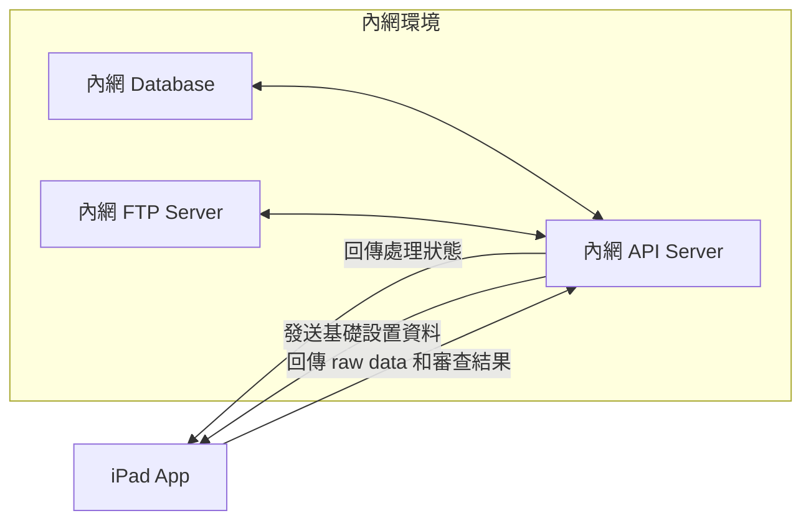
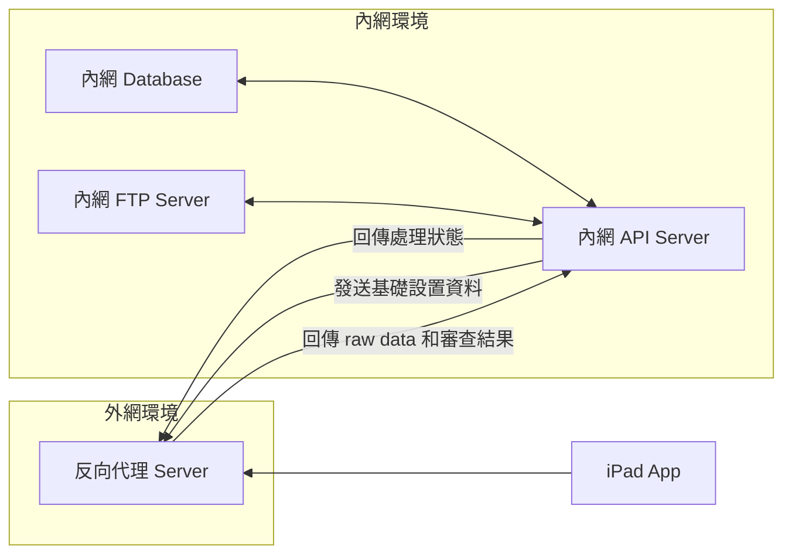
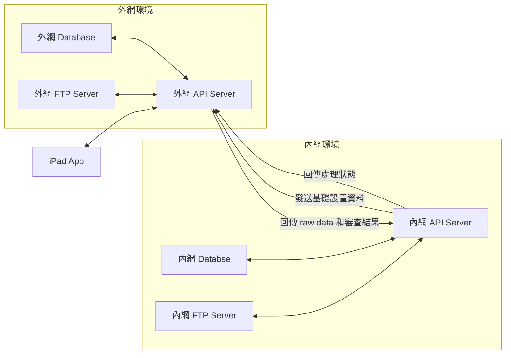

# REL 軍規及IP防水、防塵測試作業平板系統 2.0 App

## 專案簡介
這是一個用於進行 IP 防塵防水及軍規測試的 iPad 應用程式。讓檢測人員可以方便地填寫檢核項目、拍照記錄，並即時同步數據。

## 主要功能
- 檢核表單填寫
- 現場拍照記錄
- 離線作業支援
- 多人協作管理
- Word報告生成

## 目錄
- [網絡架構](#網絡架構)
- [系統架構](#系統架構)
- [Resource](#resource)

## 網絡架構

### 藍牙 PAN 網路 (試驗後不可行)
- 目前無法透過此方式，因電腦已禁用共用網路，無法共用網路藍牙
- 目前無法透過 vEthernet 建立空虛擬網路轉送，已設置後，仍需開啟共用

### 藍牙 BR/EDR 傳統模式 (試驗後不可行)
- 支持高寬帶如音頻、文件傳輸
- iPad 對系統層級藍牙模組的訪問受限，目前不支持直接使用此方式
- Air Drop 是專利技術，未開放，僅能透過模擬的方式，但前提是和電腦要在同個 Wi-Fi 網域下，所以此法也行不通

### 藍牙 BLE 藍牙低功耗模式 (試驗後不可行)
- 不適用，因該模式傳送數據封包大小受限，僅適用於如健康設備心率監測或按鍵通知

### 內網 WiFi (需 IT 開放)
- 設備可存取內網


### 外網反向代理 Reverse Proxy  (需 IT 開放)
- 設備無法存取內網，但能存取外網時的方案


**外網反向代理架構：**
1. 反向代理外網 Server
   - 放置在 DMZ 區域 (公共網路與內網之間的安全區域)
   - 外網環境只提供轉送服務，避免將內網服務直接暴露到外網
2. 內網環境
   - 業務邏輯和資料存儲服務
   - 由反向代理進行訪問控制，外部無法直接接觸內網
3. 架構優勢
   - 安全性提升
     - 外網訪問僅能透過反向代理，內網服務對外完全隱藏
     - 可以在反向代理上設置安全策略，如 IP 白名單、SSL/TLS 加密等
   - 統一入口管理
     - 外網只需對接反向代理，統一處理請求
   - 負載平衡
     - 反向代理可以實現負載平衡，將請求分發到多台內網服務器，提升性能和穩定性
   - 緩存與性能優化
     - 反向代理可實現內容緩存，減少內網服務的負擔
     - 減少內網與外網之間的頻繁交互
4. 常見的反向代理軟體
   - NGINX：輕量、高效，支援靜態內容緩存和負載平衡
   - Apache HTTP Server：功能強大，適合複雜需求
   - HAProxy：專注於高性能的負載平衡
   - Traefik：專為微服務和容器設計，適合 Kubernetes
5. 反向代理配置範例 (以 NGINX 為例)
   假設內網服務位於 http://192.168.1.100:8080，反向代理的基本配置如下
   ```nginx
   server {
       listen 80;
       server_name yourdomain.com;
   
       location / {
           proxy_pass http://192.168.1.100:8080;
           proxy_set_header Host $host;
           proxy_set_header X-Real-IP $remote_addr;
           proxy_set_header X-Forwarded-For $proxy_add_x_forwarded_for;
           proxy_set_header X-Forwarded-Proto $scheme;
   
           # 可選：啟用緩存
           proxy_cache my_cache;
           proxy_cache_valid 200 1m;
       }
   }

   # 緩存配置
   proxy_cache_path /var/cache/nginx levels=1:2 keys_zone=my_cache:10m inactive=60m use_temp_path=off;
   ```

   **SSL/TLS 加密**
   - 配置 HTTPS，確保外網請求到反向代理的通訊加密
   - 使用免費的 Let's Encrypt 或其他證書
   - NGINX 的 SSL 配置
     ```nginx
     server {
         listen 443 ssl;
         server_name yourdomain.com;
     
         ssl_certificate /etc/nginx/ssl/cert.pem;
         ssl_certificate_key /etc/nginx/ssl/cert.key;
     
         location / {
             proxy_pass http://192.168.1.100:8080;
         }
     }
     ```
     
   **訪問控制**
     - 設置 IP 白名單或黑名單，限制外部訪問
       ```nginx
       allow 203.0.113.0/24;  # 允許的 IP 範圍
       deny all;              # 拒絕其他訪問
       ```
       
   **安全頭設定**
     - 增加 HTTP 安全頭，防止常見攻擊 (如 XSS、CSRF)
       ```nginx
       add_header X-Frame-Options SAMEORIGIN;
       add_header X-Content-Type-Options nosniff;
       add_header X-XSS-Protection "1; mode=block";
       ```

   **防火牆設置**
     - 設置允許反向代理訪問

### 外網池 (API + Database + FTP Server) (需 IT 協助，但成本較高因需租用三台服務器)
- 設備無法存取內網，但能存取外網時的方案


**外網池 (API + Database + FTP Server)架構：**
1. 架構 (Azure Cloud)
   - iPad App運行於外網環境之外，僅與外網API服務器通訊
   - 外網環境負責數據中轉，儲存raw data和審查結果
   - 內網環境負責數據處理和應用，定期從外網獲取數據
   - 內網可向外網發送基礎設置資料，供iPad自動更新
2. 資料庫：PostgreSQL + Redis
   - PostgreSQL：可靠的資料存儲
   - Redis：高速緩存和會話管理
   - MinIO：檔案存儲
     - 兼容 S3 協議
     - 可自建私有雲

## 系統架構

### 前端選擇：SwiftUI (iPad App)
- 原生 iPad 體驗
- 優秀的相機整合
- 離線操作順暢
- 手寫筆支援佳
- 檢視 Word 報告

### 後端選擇：.NET Core 8 + Python FastAPI (雙方案)

#### .NET Core 8 主要方案
- 企業級穩定性
- 完整開發生態
- 強大的 ORM 支援
- 優秀的安全特性
- 高效能非同步處理
- 跨平台支援

#### Python FastAPI 備選方案
- 開發速度快
- API 文檔自動生成
- 非同步性能好
- 輕量級數據同步

## 系統優勢

### 1. 離線作業支援
- 網路不穩定時仍可工作
- 自動數據同步
- 本地資料安全存儲

### 2. 多人協作
- 即時專案狀態
- 方便查看其他人工作
- 專案分類管理

### 3. 資料安全
- 本地加密
- 安全傳輸
- 多重備份

### 4. 擴展性
- 模組化設計
- 容易添加新功能
- 靈活的報表定制

## 快速開始
1. 安裝 iPad App
2. 登入系統
3. 開始檢測工作
   - 填寫檢核表
   - 拍照記錄
   - 同步數據

## 系統需求
- iPad iOS 15.0 或以上
- 網路連接（支援離線模式）
- 相機權限

## Resource
- [Markdown](https://markdown.tw/)
- [Mermaid](https://mermaid.js.org/) - **Markdown 裡放圖表**
- [Shields.io](https://shields.io/) - **Markdown 檔 Badge 徽章效果 API**
- [Simple-icons badge slug](https://github.com/simple-icons/simple-icons/blob/master/slugs.md) - **Markdown 檔 Badge 徽章效果清單**
- [JSON Edior Online](https://jsoneditoronline.org/) - **JSON 線上編輯器含排版美化**
