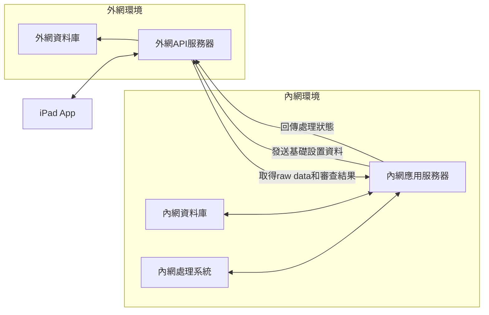

# REL 軍規及IP防水、防塵測試作業平板系統 2.0 App

## 專案簡介
這是一個用於進行 IP 防塵防水及軍規測試的 iPad 應用程式。讓檢測人員可以方便地填寫檢核項目、拍照記錄，並即時同步數據。

## 主要功能
- 檢核表單填寫
- 現場拍照記錄
- 離線作業支援
- 多人協作管理
- Word報告生成（本地）

## 系統架構

本系統採用內外網分離架構：
- iPad App運行於外網環境之外，僅與外網API服務器通訊
- 外網環境負責數據中轉，儲存raw data和審查結果
- 內網環境負責數據處理和應用，定期從外網獲取數據
- 內網可向外網發送基礎設置資料，供iPad自動更新

## 架構

### 前端選擇：SwiftUI (iPad App)
- 原生 iPad 體驗
- 優秀的相機整合
- 離線操作順暢
- 手寫筆支援佳
- 本地 Word 報告生成

### 後端選擇：.NET Core 8 + Python FastAPI (雙方案)

#### .NET Core 8 主要方案
- 企業級穩定性
- 完整開發生態
- 強大的 ORM 支援
- 優秀的安全特性
- 高效能非同步處理
- 跨平台支援

#### Python FastAPI 備選方案
- 開發速度快
- API 文檔自動生成
- 非同步性能好
- 輕量級數據同步

### 雲端服務：Azure Cloud
- 純數據中轉
- 簡單可靠
- 成本可控
- 易於維護

### 資料庫：PostgreSQL + Redis
- PostgreSQL：可靠的資料存儲
- Redis：高速緩存和會話管理

### 檔案存儲：MinIO
- 兼容 S3 協議
- 可自建私有雲
- 成本控制佳

## 系統優勢

### 1. 離線作業支援
- 網路不穩定時仍可工作
- 自動數據同步
- 本地資料安全存儲

### 2. 多人協作
- 即時專案狀態
- 方便查看其他人工作
- 專案分類管理

### 3. 資料安全
- 本地加密
- 安全傳輸
- 多重備份

### 4. 擴展性
- 模組化設計
- 容易添加新功能
- 靈活的報表定制

## 快速開始
1. 安裝 iPad App
2. 登入系統
3. 開始檢測工作
   - 填寫檢核表
   - 拍照記錄
   - 同步數據

## 系統需求
- iPad iOS 15.0 或以上
- 網路連接（支援離線模式）
- 相機權限

## Resource
- [Markdown](https://markdown.tw/)
- [Mermaid](https://mermaid.js.org/)
- [Shields.io](https://shields.io/)
- [Simple-icons badge slug](https://github.com/simple-icons/simple-icons/blob/master/slugs.md)
- [JSON Edior Online](https://jsoneditoronline.org/images/logo.png)
