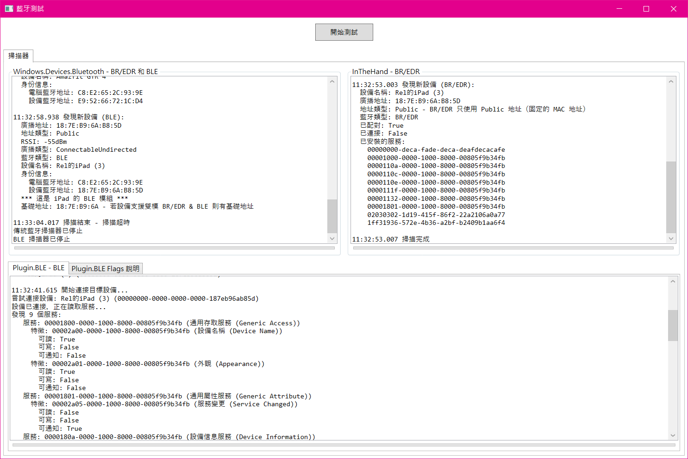
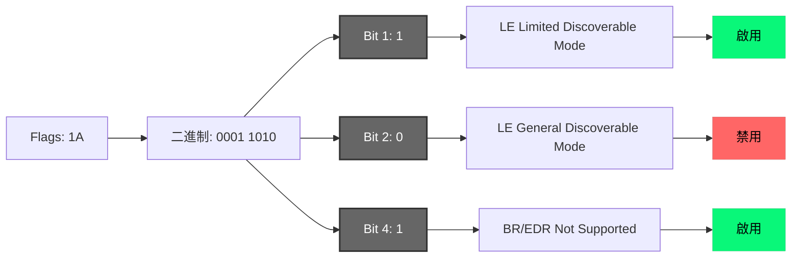
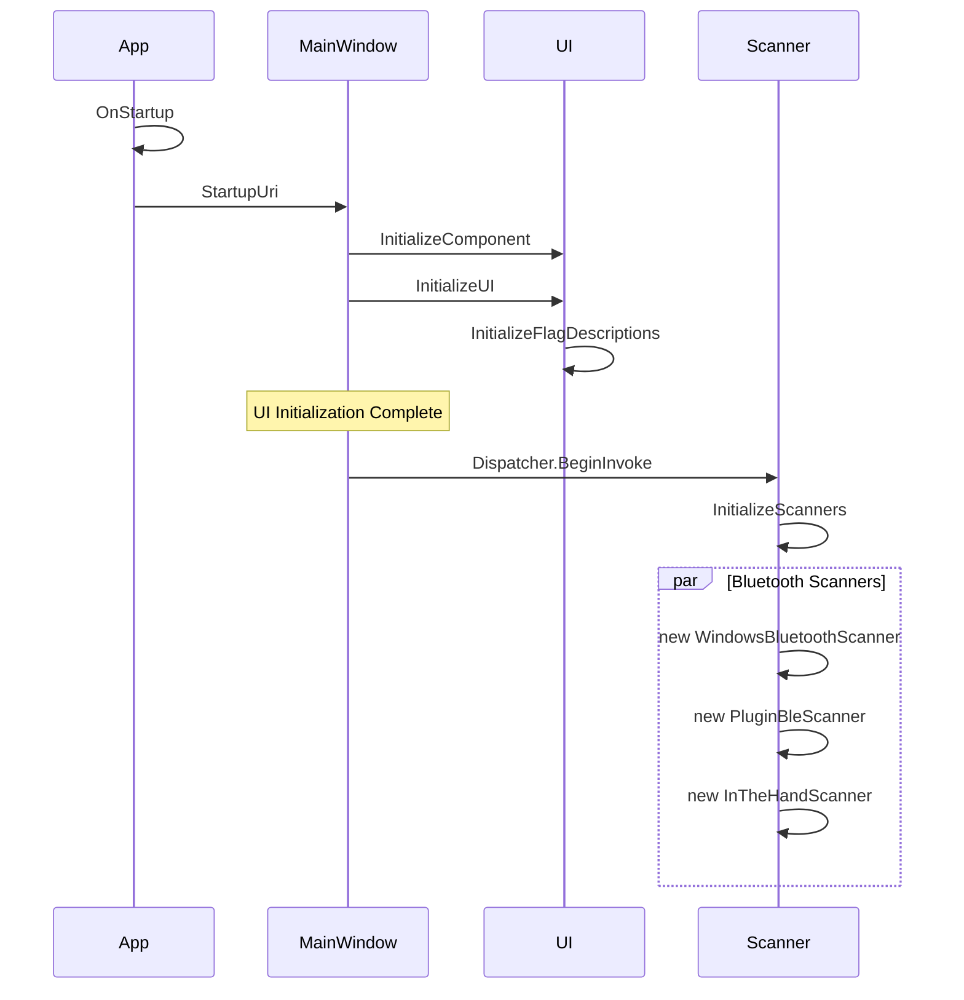
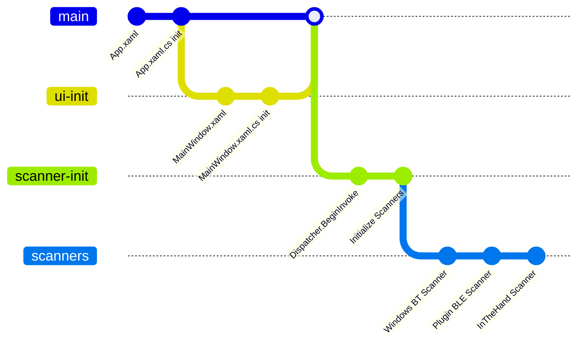
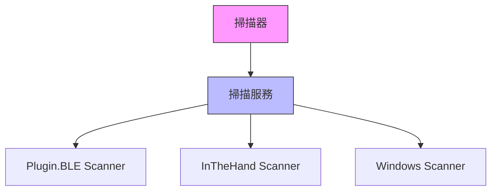

# 藍牙掃瞄應用程序說明文檔 C#

## 目錄

1. [藍牙庫功能比較](#藍牙庫功能比較)
2. [藍牙庫介紹](#藍牙庫介紹)
3. [OBEX 和 iPad 支援說明](#obex-和-ipad-支援說明)
4. [BLE Flags 說明](#ble-flags-說明)
5. [本應用程序系統架構](#本應用程序系統架構)
6. [開發環境需求](#開發環境需求)
7. [藍牙庫選擇建議](#藍牙庫選擇建議)



## 藍牙庫功能比較

| 功能特性 | InTheHand Bluetooth | Plugin.BLE | Windows.Devices.Bluetooth | 備註 |
|:---------|:-------------------|:-----------|:------------------------|:-----|
| 支援傳統藍牙 (BR/EDR) | ✅ 支援 | ❌ 不支援 | ✅ 支援 | - |
| 支援低功耗藍牙 (BLE) | ❌ 不支援 | ✅ 支援 | ✅ 支援 | - |
| 支援 OBEX 文件傳輸 | ✅ 支援 (非 Apple 系設備) | ❌ 不支援 | ❌ 不支援 | - |
| 識別 iPad | ✅ 可識別 | ✅ 可識別 | ✅ 可識別 | - |
| 服務發現 | 僅已安裝服務 | ✅ 完整 | ✅ 完整 | - |
| 特徵值發現 | 有限 | ✅ 支援 | ✅ 支援 | - |
| 即時通知 | 有限 | ✅ 支援 | ✅ 支援 | - |
| 傳輸文件 | ❌ 不支援 (iPad 不支援 OBEX) | ❌ 不支援 | ❌ 不支援 | 需使用 AirDrop 或 Wi-Fi |
| 跨平台能力 | 部分支援 | ✅ 完整支援 | ❌ 僅支援 Windows | - |
| 適用場景 | 模擬串口通信、傳統藍牙設備 | BLE 設備 (如傳感器、心率帶) | Windows 平台通用藍牙應用 | - |
| 其它 | - | - | Windows 原生 API | - |
 
```java
**注意事項**:
  - 文件傳輸功能需要使用 AirDrop 或其他 Wi-Fi 相關 API
  - iPad 的藍牙功能支援有限，需要針對具體場景選擇合適的方案
  - iPad 的文件傳輸更傾向於使用 AirDrop
    - AirDrop 以 BLE + 點對點無線 Wi-Fi 區域網技術來完成文件收送
    - 或可通過 Wi-Fi（如 HTTP Server）來實現文件收送
```

## 藍牙庫介紹

### 1. InTheHand Bluetooth (BR/EDR)

#### 特點
**支援傳統藍牙 (BR/EDR)**
- InTheHand Bluetooth 支援 Serial Port Profile (SPP) 和 RFCOMM，主要針對傳統藍牙設備（BR/EDR）
- 適合模擬串口通信的設備，例如藍牙打印機、條碼掃描器等
- 服務發現受系統權限限制
- 某些服務可能需要配對或連接後才能發現
- 只能獲取 `InstalledServices`（已安裝的主要服務）
**功能支援**
- 掃描藍牙設備
- 配對設備
- 通過 RFCOMM 建立連接，進行傳輸數據
**操作系統支援**
- 支援 Windows（10+）和部分 UWP（通用 Windows 平台）應用
**主要優勢**
- 對傳統藍牙功能有更好的支援
- 可用於模擬串口數據傳輸，實現與傳統模式的藍牙通信

#### 是否能找到 iPad 7th？
- 可以找到 iPad 7th，因為 iPad 有支援 BR/EDR

#### 是否能傳輸文件？
- 不適合傳輸文件。InTheHand Bluetooth 更適合模擬串口通信，而 iPad 不支援這種模式
- iPad 不支援 Serial Port Profile (SPP) 和 RFCOMM，因此無法使用 InTheHand 通過傳統模式進行傳輸文件
- iPad 的文件傳輸更傾向於使用 AirDrop
  - AirDrop 以 BLE + 點對點無線 Wi-Fi 區域網技術來完成文件收送

### 2. Plugin.BLE

#### 特點
**專注於 BLE (Bluetooth Low Energy) 低功耗藍牙**
- Plugin.BLE 是一個跨平台的 .NET 庫，專門用於藍牙低功耗（BLE）通信。
- 它支援掃描 BLE 設備、連接 GATT 服務，並讀取/寫入特徵值。
**功能支援**
- 掃描周圍的 BLE 設備。
- 連接到 BLE 設備上的 GATT 服務和特徵。
**操作系統支援**
- 支援 iOS、Android 和部分 Windows 平台。
**主要優勢**
- 專門用於 BLE 設備的通信，適用於需要與 iOS 或 Android 設備上的應用程序通信的場景。
- 可以獲取更詳細的服務廣播數據：
  - 主要服務（Primary Services）
  - 次要服務（Secondary Services）
  - 特徵值（Characteristics）
  - 描述符（Descriptors）
- 支援即時服務發現

#### 是否能找到 iPad 7th？
- 可以找到 iPad 7th，因為 iPad 有支援 BLE
- Plugin.BLE 適合用於連接 BLE 設備（例如藍牙心率帶、溫度傳感器等）。

#### 是否能傳輸文件？
- 不能傳輸文件。
- Plugin.BLE 是針對 BLE 通信，而 BLE 的主要設計目的是低速、低功耗的數據傳輸（例如狀態更新、傳感器數據），而不是傳輸文件。
- iPad 的文件傳輸更傾向於使用 AirDrop
  - AirDrop 以 BLE + 點對點無線 Wi-Fi 區域網技術來完成文件收送

### 3. Windows.Devices.Bluetooth

#### 特點
**Windows 原生 API - 支援傳統藍牙 (BR/EDR) 和低功耗藍牙 (BLE)**
- Windows.Devices.Bluetooth 是 Windows 平台的原生 API，提供了對於藍牙設備的全面支援。
**功能支援**
- 掃描藍牙設備。
- 配對設備。
- 通過 RFCOMM 或 GATT 建立連接，進行傳輸數據。
**操作系統支援**
- 僅支援 Windows 平台。
**主要優勢**
- 提供了對於 Windows 平台的全面支援，包括傳統藍牙和低功耗藍牙。
- 可用於開發 Windows 平台通用的藍牙應用。

#### 是否能找到 iPad 7th？
- 可以找到 iPad 7th，因為 iPad 支援 BR/EDR 和 BLE。
- 但 iPad 不支援 Serial Port Profile (SPP) 和 RFCOMM，因此無法使用 Windows.Devices.Bluetooth 通過傳統模式進行數據傳輸。

#### 是否能傳輸文件？
- 不適合傳輸文件。Windows.Devices.Bluetooth 更適合模擬串口通信或 BLE 通信。
- iPad 的文件傳輸更傾向於使用 AirDrop
  - AirDrop 以 BLE + 點對點無線 Wi-Fi 區域網技術來完成文件收送

##
## OBEX 和 iPad 支援說明

### 1. OBEX（Object Exchange Protocol）協議
- OBEX 是一個通用的對象交換協議，用於通過藍牙或紅外線進行文件傳輸，常用於傳輸文件、名片（vCard）、圖片等數據。

### 2. iPad 的 OBEX 支援
- iPad 不原生支援 OBEX 協議用於文件傳輸。Apple 的生態系統主要依賴 AirDrop（基於 Wi-Fi Direct 和 Bluetooth-BLE）來進行文件共享，而不是使用標準的藍牙 OBEX 協議。

### 3. iPad 7th 的支援情況

#### 識別 iPad 7th
- **InTheHand Bluetooth**：可以識別 iPad 作為 BR/EDR 設備，但受限於 Apple 對藍牙的限制，iPad 不會廣播 OBEX 或相關服務。
- **Plugin.BLE**：可以識別 iPad 作為 BLE 設備，但受限於 Apple 對藍牙的限制。
- **Windows.Devices.Bluetooth**：可以識別 iPad 作為 BR/EDR 或 BLE 設備。

#### 文件傳輸
- **OBEX 文件傳輸**：不可行，iPad 不支援使用 OBEX 協議進行文件傳輸，無論使用 InTheHand Bluetooth、Plugin.BLE 還是 Windows.Devices.Bluetooth。
- **替代方案**：如果需要文件傳輸，應使用 Apple 原生的 AirDrop 或通過 Wi-Fi（如 HTTP Server）來實現。

##
## BLE Flags 說明

### 1. Flags 作用
- Flags 字段是 BLE 廣播數據中的一個重要部分，用於指示設備的各種特性和能力。

### 2. 各位元 Bit 解釋

| Bit   | 值 (1=啟用, 0=禁用) | 含義 |
|:------|:-------------------|:-----------------------------|
| Bit 0 | 0                  | 不使用                        |
| Bit 1 | 1                  | LE Limited Discoverable Mode |
| Bit 2 | 1                  | LE General Discoverable Mode |
| Bit 3 | 0                  | 不使用                        |
| Bit 4 | 1                  | BR/EDR Not Supported         |
| Bit 5 | 0                  | BR/EDR Controller 不使用      |
| Bit 6 | 0                  | BR/EDR Host 不使用            |
| Bit 7 | 0                  | 保留位                        |

### 3. 重要的 Bit 解釋與範例

#### Bit 1：LE Limited Discoverable Mode
- **值為 1**：表示設備處於「有限發現模式」，只能在短時間內對其他設備可見。
- **用途**：
  - 通常用於臨時或特定情況下讓設備可見，例如配對模式或設備啟動後的初始時間段。
- **範例**：
  - BLE 健身追蹤器在初次啟動時進入 Limited Discoverable Mode，允許用戶的手機找到設備並進行初次配對。

#### Bit 2：LE General Discoverable Mode
- **值為 1**：表示設備處於「一般發現模式」，對所有 BLE 設備可見。
- **用途**：
  - 設備長期廣播，允許其他設備在範圍內找到。
- **範例**：
  - BLE 智能燈泡一直廣播其存在，以便用戶隨時能通過手機應用程序找到並連接。

#### Bit 4：BR/EDR Not Supported
- **值為 1**：表示該設備「不支援傳統藍牙（BR/EDR）」模式，僅支援 BLE。
- **用途**：
  - 確保該設備不會被誤認為支援 BR/EDR 的設備。
- **範例**：
  - BLE 心率監測器（如 Polar H10）僅支援低功耗藍牙，廣播時會將此位設為 1。

### 4. 完整示例：Flags 值 = 1A（十六進制）



##
## 本應用程序系統架構

### 初始化流程

應用程序的初始化流程如下圖所示：



### 代碼結構



初始化流程說明：

1. **應用程序啟動**
   - App.xaml 和 App.xaml.cs 初始化
   - 設置全局異常處理

2. **UI 初始化**
   - MainWindow.xaml 加載
   - InitializeComponent 完成基本 UI 初始化
   - InitializeUI 設置 UI 屬性
   - InitializeFlagDescriptions 初始化藍牙標誌說明

3. **掃描器初始化**
   - 使用 Dispatcher.BeginInvoke 確保 UI 完全加載
   - InitializeScanners 創建三個掃描器實例
   - 並行初始化三種不同的藍牙掃描器

4. **掃描器類型**
   - WindowsBluetoothScanner：Windows 原生藍牙 API，支援 BR/EDR 及 BLE
   - PluginBleScanner：專注於 BLE 設備
   - InTheHandScanner：支援傳統藍牙 BR/EDR 設備



## 開發環境需求

### SDK 需求
- .NET SDK 8.0 或更高版本
- Windows SDK 10.0.19041.0 或更高版本
- Windows 10 或更高版本的作業系統

### NuGet 套件依賴
| 套件名稱 | 版本 | 用途 |
|---------|------|------|
| Plugin.BLE | 3.1.0 | 用於 BLE（低功耗藍牙）設備的掃描和通信 |
| InTheHand.Net.Bluetooth | 4.1.40 | 用於傳統藍牙（BR/EDR）設備的掃描和通信 |

### Windows API 依賴
- Windows.Devices.Bluetooth
- Windows.Devices.Bluetooth.Advertisement
- Windows.Devices.Bluetooth.GenericAttributeProfile
- Windows.Devices.Enumeration

### 開發環境設置步驟

1. **安裝 .NET SDK**
   ```powershell
   # 清理專案：刪除所有之前的編譯輸出，包括 bin 和 obj 目錄
   # 這可以解決一些由於快取或過時檔案導致的問題
   winget install Microsoft.DotNet.SDK.8
   # 或訪問 https://dotnet.microsoft.com/download/dotnet/8.0 下載安裝
   ```

2. **安裝 Windows SDK**
   - 訪問 Microsoft 官網下載 Windows SDK (10.0.19041.0 或更高版本)
   - 或通過 Visual Studio Installer 安裝

3. **創建新專案**
   ```powershell
   # 還原套件：下載並安裝專案所需的所有 NuGet 套件
   # 確保所有依賴項都正確安裝到正確的版本
   dotnet new wpf -n BluetoothServices
   cd BluetoothServices
   ```

4. **安裝必要的 NuGet 套件**
   ```powershell
   # 建置專案：將源代碼編譯成可執行檔案
   # 這會在 bin 目錄下生成執行檔和所需的 DLL 檔案
   dotnet add package Plugin.BLE --version 3.1.0
   dotnet add package InTheHand.Net.Bluetooth --version 4.1.40
   ```

5. **修改專案檔**
   - 確保專案檔 (.csproj) 包含正確的 Windows SDK 版本和平台設置：
   ```xml
   <PropertyGroup>
     <TargetFramework>net8.0-windows10.0.19041.0</TargetFramework>
     <Platforms>x64</Platforms>
     <UseWPF>true</UseWPF>
   </PropertyGroup>
   ```

6. **編譯和運行**
   ```powershell
   # 清理專案：刪除所有之前的編譯輸出，包括 bin 和 obj 目錄
   # 這可以解決一些由於快取或過時檔案導致的問題
   dotnet clean

   # 還原套件：下載並安裝專案所需的所有 NuGet 套件
   # 確保所有依賴項都正確安裝到正確的版本
   dotnet restore

   # 建置專案：將源代碼編譯成可執行檔案
   # 這會在 bin 目錄下生成執行檔和所需的 DLL 檔案
   dotnet build

   # 運行應用程序：執行編譯後的程序
   # 這個命令會自動執行 restore 和 build（如果需要）
   dotnet run
   ```

## 藍牙庫選擇建議

1. 如果需要與傳統藍牙設備通信：
   - 在 Windows 平台上優先使用 Windows.Devices.Bluetooth
   - 需要跨平台支援時使用 InTheHand

2. 如果需要與現代 BLE 設備通信：
   - 優先使用 Plugin.BLE
   - Windows 平台也可以考慮 Windows.Devices.Bluetooth

3. 如果需要同時支援兩種藍牙類型：
   - Windows 平台：使用 Windows.Devices.Bluetooth
   - 跨平台：組合使用 InTheHand 和 Plugin.BLE

4. 如果您需要識別 iPad：
   - 使用 Plugin.BLE (跨平台) 或 InTheHand Bluetooth。

5. 如果您需要傳輸文件：
   - 通過 Wi-Fi 或 HTTP 實現。
   - iPad 文件傳輸應考慮 AirDrop 或通過 Wi-Fi（如 HTTP Server）來實現。

### 注意事項
- 需要啟用系統的藍牙功能
- 需要適當的藍牙硬體支援（建議支援 BLE 和傳統藍牙）
- 某些藍牙操作可能需要管理員權限
- 在 Windows 設置中確保已授予應用程序藍牙權限 